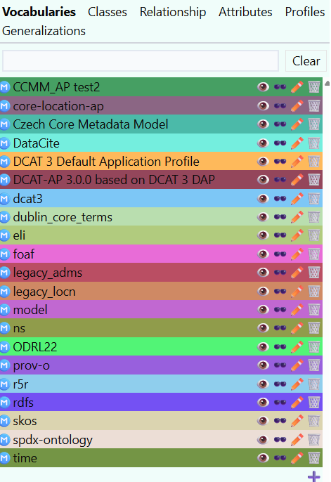
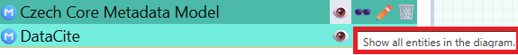
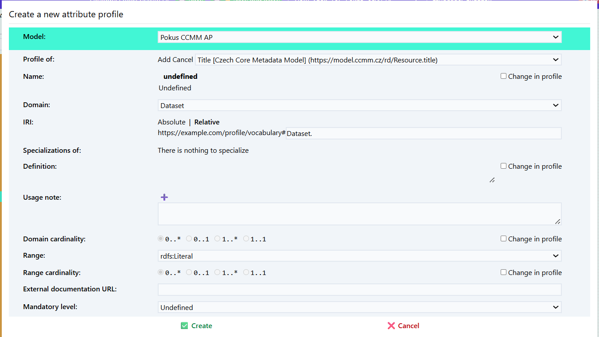

Aplikační profil (application profile, AP) v oblasti modelování metadat je soubor pravidel a specifikací, který určuje, jak se mají používat existující metadatové standardy v konkrétním kontextu (v našem případě repozitáři).
Než začneme v Datasecpeceru vytvářet samotný aplikační profil pro náš repozitář, je nutné se podrobně seznámit s výchozím metadatovým modelem. [Czech core metadata model](https://eosc-cz.github.io/CCMM/cs/)

## Co si ujasnit před vytvořením metadatového profilu pro repozitář
1. Co budeme popisovat. Umožňuje výchozí metadatový model (CCMM) a dostupné slovníky popsat všechny potřebné entity? Existují oborové slovníky, které je možné pro náš repozitář využít? Jsou dostupné ve vhodném formátu?

2. Rozmyslíme si co jaké prvky z výchozího metadového modelu převezmeme a jakým způsobem je budeme používat, upravovat, Nastavíme pravidla jak je budeme používat (zda budou povinné v metadatovém popisu, kardinalitu apod.).

3. V případě, že potřebujeme podrobnější metadatový popis než umožňuje si výchozí metadatový model, či slovníky, musíme vložit slovník nový  (přes URL v TTL formátu ) nebo s nadefinujeme slovník nový.

Slovníky či aplikační profily, které budeme v Dataspeceru použít, musí být hostovány na webovém serveru  podporujícím techniku [Cross origin resource sharing ](https://fetch.spec.whatwg.org/#http-cors-protocol) (CORS). Případně je třeba je nakopírovat na web, který techniku CORS podporuje.

## Vytvoření nového aplikačního profilu
V hlavním menu zvolte možnost „Průvodce projektem“ – Vytvořit aplikační profil.

1. Zadejte **název projektu** (např. „CCMM AP“).

2. Vložte **URL specifikaci** modelu, ze kterého chcete aplikační profil vytvořit.  
   Pokud vytváříte aplikační profil pro CCMM, vložte link na něj:  
   [https://eosc-cz.github.io/CCMM/cs/](https://eosc-cz.github.io/CCMM/cs/)

3. Vyplňte **Base IRI** – základní IRI (Internationalized Resource Identifier),  
   pod kterým budou identifikovány prvky vašeho profilu:  

   **Poznámka:** Doporučujeme promyslet předem; lze jej však později upravit.
Záložka *profile* obsahuje všechny slovniky použité ve výchozím metadatovém modelu.
Mohu si zobrazit co obsahuje zvolený slovník.

   [https://example.com/profile/mujprofil/](https://example.com/profile/mujprofil/)

V hlavním rozhraní vidíme po levé straně katalog. Ten obsahuje prvky které můžeme přidat do vlastního aplikačního profilu. 

V horním rozhraní mám možnnost práci uložit (tlačítko save). Práci je třeba pravidelně ukládat. V Dataspeceru není automatické ukládání.
 
**Classes (Třídy)**

** Relationships(Vztahy)** Vztahy mezi jednotlivými třídami. 

** Attributes (Atributy)** Vlastnosti tříd.

** Profiles (Profily)** Zde vidíme všechny prvky přidané do vytvořeného aplikačnního profilu. 

** Generalizations ** Obsahuje všechno předchozí. 

## ▶️ Definice tříd zahrnutých do aplikačního profilu

Po vytvoření nového aplikačního profilu se nám otevře editor aplikačního profilu.

Záložka *profile* obsahuje všechny prvky použité ve výchozím metadatovém modelu.

Zvolím položku, kterou chci přidat do mého aplikačního profilu (např. Agent).  
Klikneme na **Create new profile** (symbol podkovy).

Rozhodneme se, zda chceme třídu převzít tak, jak je definována ve výchozím metadatovém modelu, nebo ji budeme upravovat.

**Name:** Pojmenování třídy.

**IRI** *(International Resource Identifier)* Identifikátor třídy.

**Specialization:** Zda se jedná o specializaci jiné třídy.

**Definition:** Stručný popis dané třídy. Možné uvést i v několika jazycích.  
**Příklad:** Agent: Any entity carrying out actions with respect to the entities Catalogue and the Catalogued Resources.*

**Usage note:** Poznámka k použití dané třídy. Př. "V tomto profilu se dataset pooužívá pro XYZ."

**External documentation:** Odkaz na externí dokumentaci popisující danou třídu.

**Role:** Určím se zda bude role hlavní (main) nebo podpůrná (supportive). Hlavní role jsou důležité prvky metadatového profilu př. dataset, katalog. Podpůrná zahrnuje méně důležité např. téma. Role se nedědí mezi profily.

Vlevo vidím katalog - třídy v aplikačním profiu. Přidané jsou vybarvené zeleně. Vpravo je vizuální model kde vidím

## ▶️ Přidání atributů
U tříd je následně třeba přidat atributy.
1. Atribut přidám symbolem plus. 

2. Nadefinujte si pro z čeho vycházíte **Profile of** a pro jakou třídu atribut definujete **Domain**

## ▶️ Přidání vztahů mezi třídami
Nyní si přidáme do svého profilu další třídu (funding reference).
V části relationsh přidám vztah mezi těmito třídami (has funding reference).

1. Atribut přidám symbolem plus.

2. Nadefinujte si pro z čeho vycházíte **Profile of** a pro jakou třídu atribut definujete **Domain**
**Cardinality**
Kolikrát může nebo musí být určitý vztah nebo vlastnost mezi dvěma třídami použit. Jinak řečeno, popisuje počet výskytů, které jsou povolené nebo požadované mezi objekty.

Například pokud má datová sada (Dataset) vlastnost title, kardinalita 1..1 znamená, že musí mít právě jeden název. Pokud by byla kardinalita 0..*, může mít žádný, jeden nebo více názvů.

Kardinalita se často zapisuje ve formátu:

0..1 – nejvýše jeden výskyt (nepovinný),

1..1 – právě jeden výskyt (povinný),

0..* – libovolný počet výskytů (včetně nuly),

1..* – alespoň jeden výskyt.

**Specializace**
* Dopsat jak to funguje.

## ▶️ Nadefinování vlastních pojmů ve Slovníku

V případě, že chci do aplikačního profilu přidat vlastní prvky které nejsou součástí CCMM, nadefinuji si je ve slovníku. 

Můžu využít často používaných slovníků (well known vocabularies), importovat slovník prostřednictvím url (vocabulary from url - je třeba abyl odakaz na slovník v ttl formátu),případně si nadefinovat vlastní.

Vytvořím si nový slovník a přidám nové pojmy (symbol plus). Musím vyplnit název, IRI a definici. 
Následně se nadefinované pojmy přidám do aplikačního profilu.

