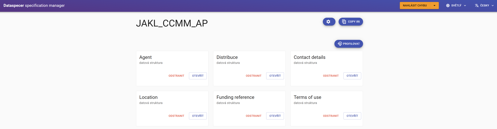
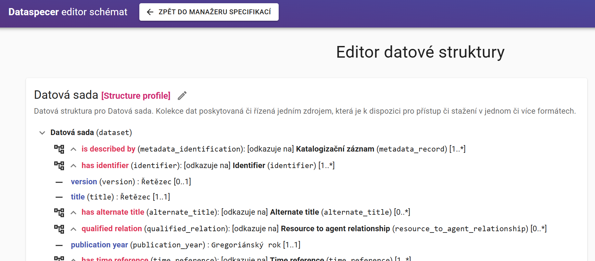
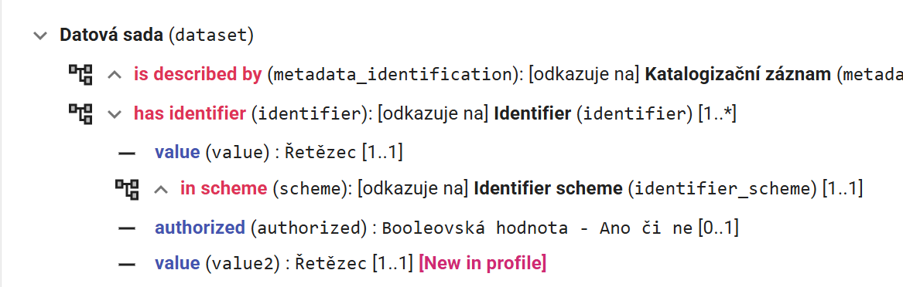
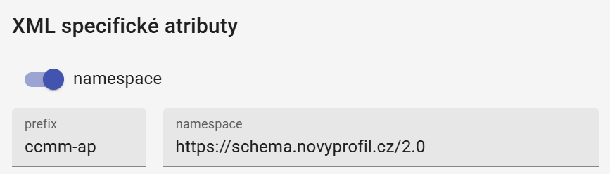

Pokud jsme vytvořili profil CCMM s možností "Autoprofile", vytvořily se nám i profily datových struktur.



Ty využijeme proto, aby výsledná XML schémata byla i strukturálně kompatibilní s těmi v CCMM.
Při pohledu na konkrétní strukturu uvidíme tag `[Structure profile]`, který říká, že tato datová struktura je profilem existující datové struktury (z CCMM).
Konkrétně pak XML instance takto rozšířených datových struktur by měly být validní podle originálního CCMM XSD, které však nebude validovat případné rozšíření.
XSD vygenerovaná z profilu datové struktury pak budou validovat CCMM včetně rozšíření.



Do profilu datové struktury můžeme přidávat nové položky z aktuálního aplikačního profilu, rozšiřující v daném místě datovou strukturu CCMM. Nepovinné položky můžeme i odebírat.
Nové položky uvidíme se značkou `[New in profile]`.



Rozšířené datové struktuře také nastavíme vlastní prefix a XML namespace.



Při generování výsledné dokumentace dostaneme ke každému profilu datové struktury 2 XML schémata:

XML schéma s targetNamespace CCMM, např. `https://schema.ccmm.cz/research-data/1.1`, kde před placeholderem `<xs:any>` bude použito námi specifikované rozšíření odkazující na rozšiřující XML schéma.
  
```xml
<xs:schema xmlns:xs="http://www.w3.org/2001/XMLSchema" 
xmlns:vc="http://www.w3.org/2007/XMLSchema-versioning" 
vc:minVersion="1.1" elementFormDefault="qualified" 
xmlns:ccmm="https://schema.ccmm.cz/research-data/1.1" 
xmlns:sawsdl="http://www.w3.org/ns/sawsdl" 
xmlns:xml="http://www.w3.org/XML/1998/namespace" 
xmlns:ccmm-ap="https://schema.novyprofil.cz/2.0"
targetNamespace="https://schema.ccmm.cz/research-data/1.1">
  <xs:import namespace="https://schema.novyprofil.cz/2.0" schemaLocation="/jakl_ccmm_ap/dataset/schema.ccmm-ap-extension.xsd"/>
  <xs:complexType name="dataset" sawsdl:modelReference="http://www.w3.org/ns/dcat#Dataset">
    <xs:sequence>
      ...
      <xs:element ref="ccmm-ap:additional_publication_year"/>
```

Rozšiřující XML schéma s namespace rozšíření, odkazované z minulého XSD.


