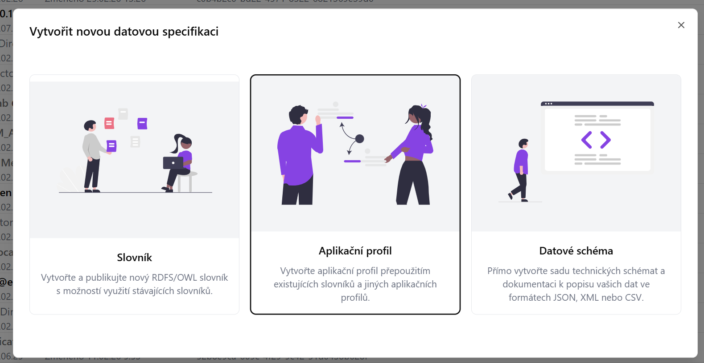
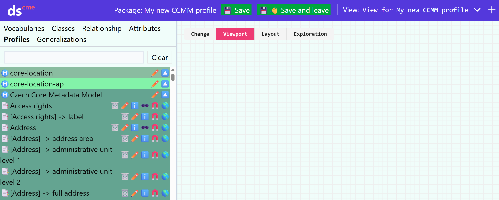
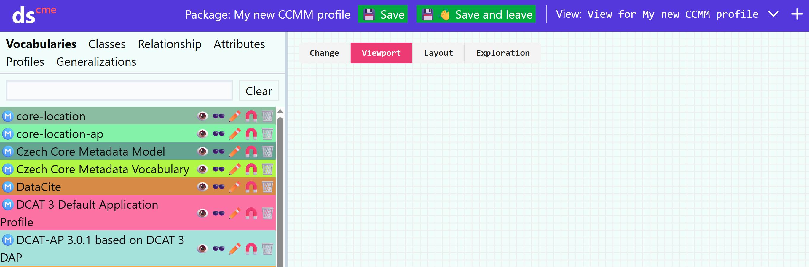
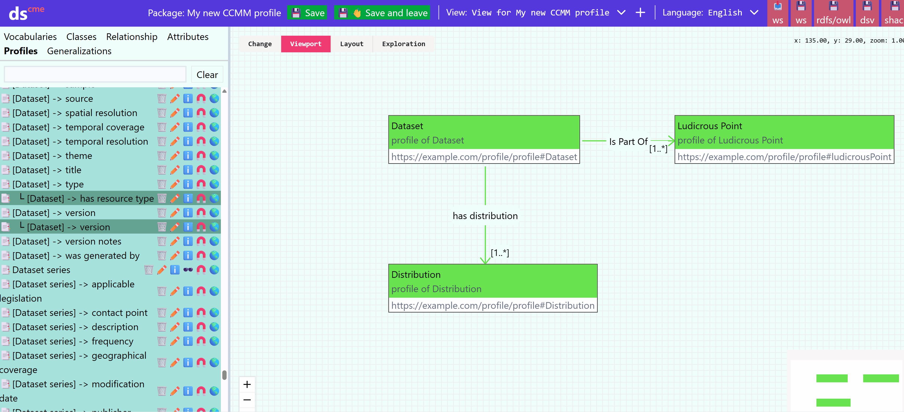
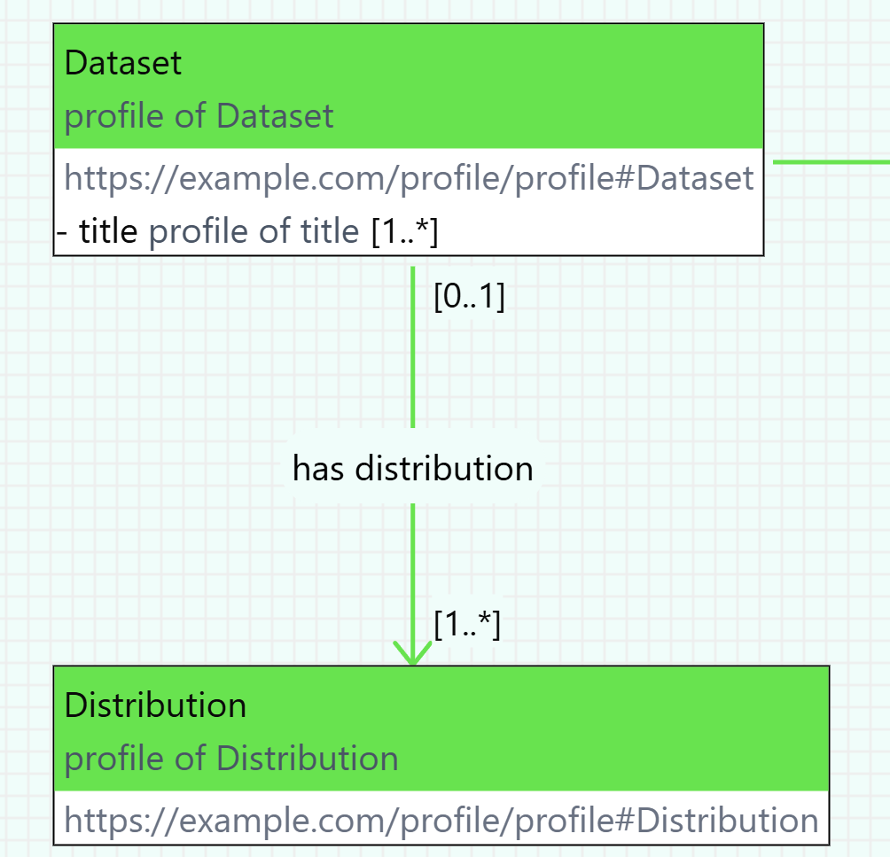

Aplikační profil (application profile, AP) definuje, jaké pojmy z jakých specifikací, slovníků či jiných aplikačních profilů, se v daném kontextu používají a jak.
Než začneme v Datasecpeceru vytvářet samotný aplikační profil pro náš repozitář, je nutné se podrobně seznámit s výchozím metadatovým modelem [Czech Core Metadata Model (CCMM)](https://www.ccmm.cz/).

## Co si ujasnit před vytvořením metadatového profilu pro repozitář
1. Potřebujeme vlastní aplikační profil? Pokud CCMM pokrývá mé potřeby, žádný jiný aplikační profil nepotřebuji.

2. Co budeme popisovat? Umožňuje výchozí metadatový model (CCMM) a dostupné slovníky popsat všechny potřebné entity? Existují oborové slovníky, které je možné pro náš repozitář využít? Jsou dostupné ve vhodném formátu, tj. RDF? Pokud ne, potřebujeme chybějící pojmy dodefinovat ve [vlastním slovníku](slovníky.md), který bude dále použit v novém aplikačním profilu.

3. Rozmyslíme si, jaké prvky z CCMM a dalších slovníků či profilů převezmeme, a jakým způsobem je budeme používat v našem profilu. Nastavíme pravidla, jak je budeme používat. Např. zda budou povinné, s jakou kardinalitou, apod. Přitom nesmíme porušit pravidla CCMM.

Slovníky či aplikační profily, které budeme chtít v Dataspeceru použít, musí být hostovány na webovém serveru podporujícím techniku [Cross origin resource sharing (CORS)](https://fetch.spec.whatwg.org/#http-cors-protocol).
Pokud jsou hostovány na serveru, který techniku CORS nepodporuje, a není v naší moci podporu zajistit, můžeme daný soubor nakopírovat na web, který techniku CORS podporuje, např. [GitHub Pages](https://pages.github.com).

## Vytvoření nového aplikačního profilu
V hlavním menu zvolte možnost „Průvodce projektem“ – Vytvořit aplikační profil.

1. Zadejte **název projektu** (např. „CCMM AP pro doménu XY“).

2. Vložte **URL specifikaci** modelu, ze kterého chcete aplikační profil vytvořit.  
   Pokud vytváříte aplikační profil pro CCMM, vložte link na něj:  
   [https://techlib.github.io/CCMM/en/](https://techlib.github.io/CCMM/en/)

3. Vyplňte **Base IRI** – základní IRI (Internationalized Resource Identifier),  
   pod kterým budou identifikovány prvky vašeho profilu: `https://example.com/profile/mujprofil/`

   **Poznámka:** Doporučujeme promyslet předem; lze jej však později upravit.
Záložka *profile* obsahuje všechny slovníky použité ve výchozím metadatovém modelu.
Mohu si zobrazit co obsahuje zvolený slovník.

### Začínáme profilovat - všechno nebo nic
Jakmile vytvoříme aplikační profil, a pro jednoduchost předpokládejme, že se jedná o profil CCMM, uvítá nás [editor modelu](editor-modelu.md) s prázdným plátnem reprezentujícím nový aplikační profil.
Zde máme dvě možnosti jak postupovat.
Buďto si z CCMM chceme vybrat, co použijeme, což postupně uděláme pomocí ikony 🧲 u profilů tříd, vlastností a atributů, o které máme zájem, v záložce `Profiles`.

Alternativně můžeme profilovat vše v CCMM, a co nepotřebujeme, postupně odmazávat.
To uděláme ikonou 🧲 u modelu `Czech Core Metadata Model` v záložce `Vocabularies`.

### Vytvoření profilu třídy

Do aplikačního profilu můžeme přidávat buďto profily tříd, atributů a vlastností ze slovníků v příslušných záložkách katalogu, nebo profily jejich profilů v existujících aplikačních profilech, na záložce `Profiles`.
Profil v aktuálním aplikačním profilu vždy vytvoříme ikonkou 🧲.

Profily tříd, vlastností, atributů a jejich profilů, které jsou v aktuálním aplikačním profilu, uvidíme na záložce `Profiles`.

Po kliknutí na 🧲 se otevře okno pro nastavení profilu.
U tříd je možno upravovat:

**Name:** Pojmenování třídy.

**IRI** *(International Resource Identifier)* Identifikátor třídy - musí být unikátní, což Dataspecer nezajišťuje.

**Specialization:** Zda se jedná o specializaci jiné třídy.

**Definition:** Definice profilu třídy. Možné uvést i v několika jazycích. 

**Usage note:** Poznámka k použití dané třídy v kontextu aplikačního profilu. Např. "V tomto profilu se dataset používá pro XYZ."

**External documentation URL:** Odkaz na externí dokumentaci popisující danou třídu. Tento odkaz se použije v profilech aktuálního profilu místo z tohoto profilu vygenerované dokumentace.

**Role:** Určím zda bude mít profil třídy roli hlavní (main) nebo podpůrnou (supportive). Hlavní role jsou důležité prvky metadatového profilu př. dataset, katalog. Podpůrná zahrnuje méně důležité např. téma. Role se nedědí mezi profily. Ve výsledné dokumentaci jsou pak profily tříd sdruženy právě podle role - nejprve hlavní, pak až vedlejší.

### Vytvoření profilu atributu

1. V záložce `Profiles` nebo `Attributes` vybereme profil atributu nebo atribut, jehož profil chceme vytvořit (jež chceme použít v našem AP), a stiskneme 🧲.
2. Nastavíme profil třídy v aktuálním AP, který bude doménou profilu atributu.
3. (Volitelně) Můžeme upravit název, identifikátor, definici a poznámku k jeho použití v rámci našeho aplikačního profilu a URL externí dokumentace.
4. (Volitelně) Nastavíme kardinalitu **Range cardinality**
5. (Volitelně) Vybereme datový typ v **Range**, např. `xsd:boolean`, `xsd:string`, `rdf:langString` apod.
6. (Volitelně) Vybereme úroveň povinnosti - `Undefined`, pokud toto v našem AP nepoužíváme, případně `Mandatory`, `Recommended` nebo `Optional`, pokud ano. V rámci diagramu pak budou atributy v sekcích dle této povinnosti.

**Poznámka:** U atributů a jejich profilů, případně vztahů zobrazených jako atributy, tj. v rámci třídy či profilu třídy, lze měnit pořadí pomocí 🔼🔽 po kliknutí na třídu. Alternativně lze měnit pořadí, a měnit zobrazení vztahů jako atributů v dialogu po stisknutí tlačítka 📏 na třídě.

### Vytvoření profilu vztahu
Pro vytvoření profilu vztahu postupujeme stejně jako u profilu atributu, tj. v katalogu v záložce `Relationships` nebo `Profiles` tlačítkem 🧲.

Jediným rozdílem je to, že potřebujeme vybrat nejen doménu, ale i obor hodnot (range) profilu vztahu, opět jeden z profilů tříd v našem AP.
Také může mít smysl vyplňovat **Domain cardinality** pro určení kardinality v opačném směru vztahu.

Zopakujme si, co kardinality znamenají.

V příkladu je mezi profilem třídy `Dataset`a profilem třídy `Distribution`profil vazby `has distribution`, vedoucí z `Dataset` (domain) do `Distribution` (range).

Range cardinality `[1..*]` znamená, že každá datová sada má vždy alespoň jednu distribuci, ale může jich mít více.
Domain cardinality `[0..1]` znamená pro každou distribuci, že může ale nemusí být propojena s datovou sadou, a když, tak maximálně s jednou.