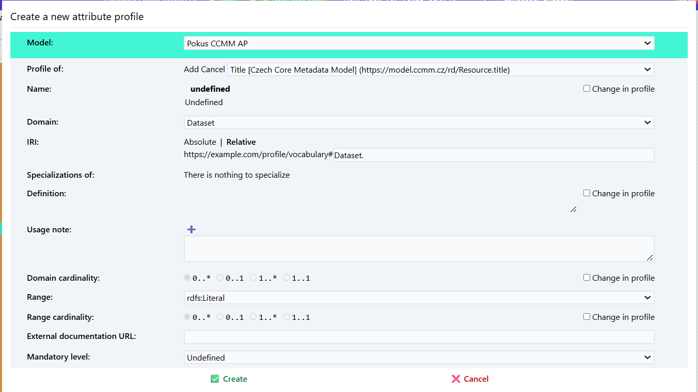

Aplikační profil (application profile, AP) definuje, jaké pojmy z jakých specifikací, slovníků či jiných aplikačních profilů, se v daném kontextu používají a jak.
Než začneme v Datasecpeceru vytvářet samotný aplikační profil pro náš repozitář, je nutné se podrobně seznámit s výchozím metadatovým modelem [Czech Core Metadata Model (CCMM)](https://www.ccmm.cz/).

## Co si ujasnit před vytvořením metadatového profilu pro repozitář
1. Potřebujeme vlastní aplikační profil? Pokud CCMM pokrývá mé potřeby, žádný jiný aplikační profil nepotřebuji.

2. Co budeme popisovat? Umožňuje výchozí metadatový model (CCMM) a dostupné slovníky popsat všechny potřebné entity? Existují oborové slovníky, které je možné pro náš repozitář využít? Jsou dostupné ve vhodném formátu, tj. RDF? Pokud ne, potřebujeme chybějící pojmy dodefinovat ve [vlastním slovníku](slovníky.md), který bude dále použit v novém aplikačním profilu.

3. Rozmyslíme si, jaké prvky z CCMM a dalších slovníků či profilů převezmeme, a jakým způsobem je budeme používat v našem profilu. Nastavíme pravidla, jak je budeme používat. Např. zda budou povinné, s jakou kardinalitou, apod. Přitom nesmíme porušit pravidla CCMM.

Slovníky či aplikační profily, které budeme chtít v Dataspeceru použít, musí být hostovány na webovém serveru podporujícím techniku [Cross origin resource sharing (CORS)](https://fetch.spec.whatwg.org/#http-cors-protocol).
Pokud jsou hostovány na serveru, který techniku CORS nepodporuje, a není v naší moci podporu zajistit, můžeme daný soubor nakopírovat na web, který techniku CORS podporuje, např. [GitHub Pages](https://pages.github.com).

## Vytvoření nového aplikačního profilu
V hlavním menu zvolte možnost „Průvodce projektem“ – Vytvořit aplikační profil.

1. Zadejte **název projektu** (např. „CCMM AP pro doménu XY“).

2. Vložte **URL specifikaci** modelu, ze kterého chcete aplikační profil vytvořit.  
   Pokud vytváříte aplikační profil pro CCMM, vložte link na něj:  
   [https://techlib.github.io/CCMM/en/](https://techlib.github.io/CCMM/en/)

3. Vyplňte **Base IRI** – základní IRI (Internationalized Resource Identifier),  
   pod kterým budou identifikovány prvky vašeho profilu: `https://example.com/profile/mujprofil/`

   **Poznámka:** Doporučujeme promyslet předem; lze jej však později upravit.
Záložka *profile* obsahuje všechny slovniky použité ve výchozím metadatovém modelu.
Mohu si zobrazit co obsahuje zvolený slovník.

### Začínáme profilovat - všechno nebo nic
Jakmile vytvoříme aplikační profil, a pro jednoduchost předpokládejme, že se jedná o profil CCMM, uvítá nás [editor modelu](editor-modelu.md) s prázdným plátnem reprezentujícím nový aplikační profil.
Zde máme dvě možnosti jak postupovat.
Buďto si z CCMM chceme vybrat, co použijeme, což postupně uděláme pomocí ikony 🧲 u profilů tříd, vlastností a atributů, o které máme zájem, v záložce Profily.

Alternativně můžeme profilovat vše v CCMM, a co nepotřebujeme, postupně odmazávat.
To uděláme ikonou 🧲 u modelu Czech Core Metadata Model v záložce Vocabularies.

### Výběr tříd zahrnutých do aplikačního profilu

Po vytvoření nového aplikačního profilu se nám otevře editor aplikačního profilu.

Záložka *profile* obsahuje všechny prvky použité ve výchozím metadatovém modelu.

Zvolím položku, kterou chci přidat do mého aplikačního profilu (např. Agent).  
Klikneme na **Create new profile** (symbol podkovy).

Rozhodneme se, zda chceme třídu převzít tak, jak je definována ve výchozím metadatovém modelu, nebo ji budeme upravovat.

**Name:** Pojmenování třídy.

**IRI** *(International Resource Identifier)* Identifikátor třídy.

**Specialization:** Zda se jedná o specializaci jiné třídy.

**Definition:** Stručný popis dané třídy. Možné uvést i v několika jazycích.  
**Příklad:** Agent: Any entity carrying out actions with respect to the entities Catalogue and the Catalogued Resources.*

**Usage note:** Poznámka k použití dané třídy. Př. "V tomto profilu se dataset pooužívá pro XYZ."

**External documentation:** Odkaz na externí dokumentaci popisující danou třídu.

**Role:** Určím zda bude role hlavní (main) nebo podpůrná (supportive). Hlavní role jsou důležité prvky metadatového profilu př. dataset, katalog. Podpůrná zahrnuje méně důležité např. téma. Role se nedědí mezi profily.

### Přidání atributů

U tříd je možné  přidat atributy. Atribut je vlastnot třídy.

1. Atribut přidám symbolem plus. 

2. Nadefinujte si pro z čeho vycházíte **Profile of** a pro jakou třídu atribut definujete **Domain**.

3. Přidáme jeho popis (je možné vícejazyčně) **Definition**.

4. Poznámku k jeho použití v rámci našeho aplikačního profilu **Usage note**.

5. Nastavíme kardinalitu - opakovatelnost **Domain cardinality**.

6. Vybereme jaký typ znaků může atribut obsahovat **Range**.

### Přidání vztahů mezi třídami
Nyní si přidáme do svého profilu další třídu (funding reference).

V části relationship přidám vztah mezi těmito třídami (has funding reference)

**Cardinality**
Určuje kolikrát může nebo musí být určitý vztah nebo vlastnost mezi dvěma třídami použit. Jinak řečeno, popisuje počet výskytů, které jsou povolené nebo požadované mezi objekty.

Například pokud má datová sada (Dataset) vlastnost title, kardinalita `1..1` znamená, že musí mít právě jeden název. Pokud by byla kardinalita `0..*`, může mít žádný, jeden nebo více názvů.

Kardinalita se často zapisuje ve formátu:

`0..1` – nejvýše jeden výskyt (nepovinný),

`1..1` – právě jeden výskyt (povinný),

`0..*` – libovolný počet výskytů (včetně nuly),

`1..*` – alespoň jeden výskyt.

