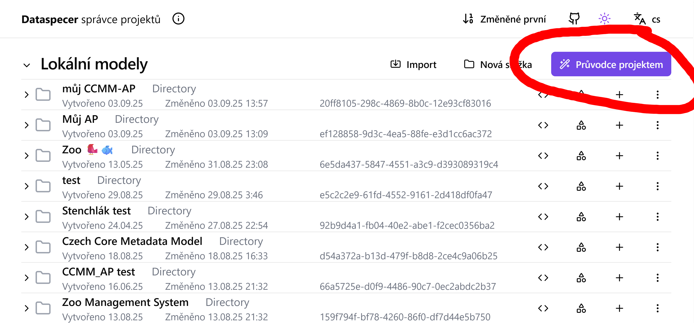
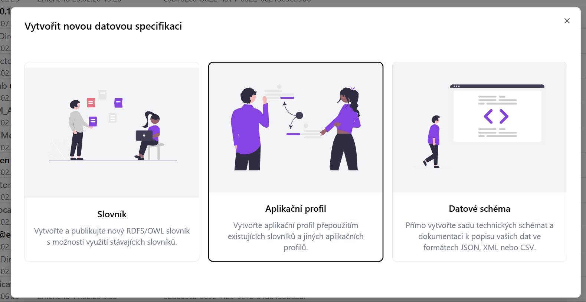
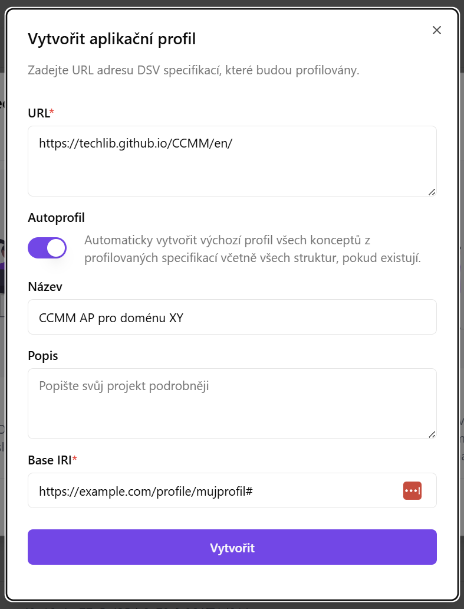
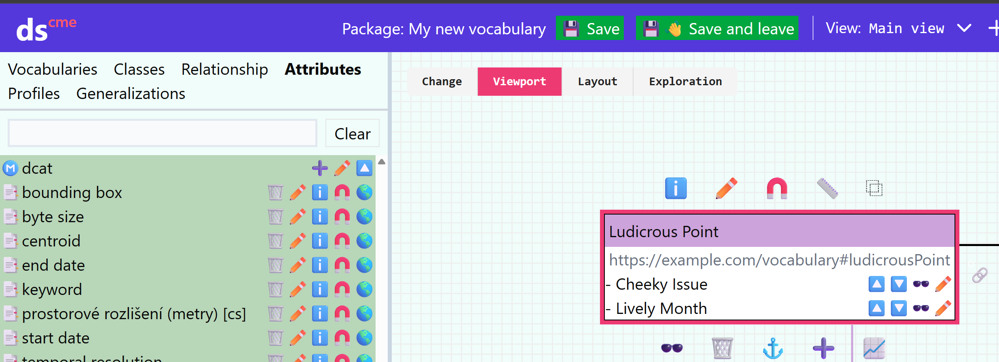

Aplikační profil (application profile, AP) v oblasti modelování metadat je soubor pravidel a specifikací, který určuje, jak se mají používat existující metadatové standardy v konkrétním kontextu (v našem případě metadata doménového repozitáře).
Než začneme v Datasecpeceru vytvářet samotný aplikační profil pro náš repozitář, je nutné se podrobně seznámit s výchozím metadatovým modelem. [Czech Core Metadata Model (CCMM)](https://techlib.github.io/CCMM/en/).

## Co si ujasnit před vytvořením metadatového profilu pro repozitář
1. Potřebujeme vlastní aplikační profil? Pokud CCMM pokrývá mé potřeby, žádný jiný aplikační profil nepotřebuji.

2. Co budeme popisovat? Umožňuje výchozí metadatový model (CCMM) a dostupné slovníky popsat všechny potřebné entity? Existují oborové slovníky, které je možné pro náš repozitář využít? Jsou dostupné ve vhodném formátu, tj. RDF? Pokud ne, potřebujeme chybějící pojmy dodefinovat ve vlastním slovníku, který bude dále použit v novém aplikačním profilu.

3. Rozmyslíme si, jaké prvky z CCMM a dalších slovníků či profilů převezmeme, a jakým způsobem je budeme používat v našem profilu. Nastavíme pravidla, jak je budeme používat. Např. zda budou povinné, s jakou kardinalitou, apod. Přitom nesmíme porušit pravidla CCMM.

## Vytvoření nového aplikačního profilu
V hlavním menu zvolte možnost „Průvodce projektem“ – Vytvořit aplikační profil.

Vyberte "Aplikační profil"

1. Do **URL** vložte URL specifikace, ze které chcete aplikační profil vytvořit. 
   Pokud vytváříte aplikační profil pro CCMM, vložte link na něj:
   [https://techlib.github.io/CCMM/en/](https://techlib.github.io/CCMM/en/).
   Pokud už teď víte, že chcete profilovat i další specifikace, volžte na další řádky i jejich URL.

2. Nechte vybrané **Autoprofil** - vytovří se tím profil celého CCMM (případně i dalších specifikací), včetně datových struktur. V editoru modelu nebudou profily tříd a vlastností přidány na plátno - to lze udělat ručně - v profilu však budou.

3. Zadejte **Název** (např. „CCMM AP pro doménu XY“), případně **Popis**

4. Vyplňte **Base IRI** – základ IRI (Internationalized Resource Identifier),  
   prvků vašeho profilu: `https://example.com/profile/mujprofil#`

   **Poznámka:** Doporučujeme promyslet předem; lze jej však později upravit.
Záložka *profile* obsahuje všechny slovniky použité ve výchozím metadatovém modelu.
Mohu si zobrazit co obsahuje zvolený slovník.

Po vytvoření nového aplikačního profilu se otevře editor modelu.

Záložka *Profiles* obsahuje všechny profily tříd a vlastností z aplikačních profilů v hierarchii.

Zde mohu odebírat nepotřebné profily tříd a vlastností, případně prohlížet existující.

Pro přidání nového profilu třídy či vlastnosti je třeba najít to, co chci profilovat, a vytvořit profil tlačítkem 🧲.
To může být profil třídy, profil atributu či profil vztahu v případě, že chci profilovat něco z existujícího aplikačního profilu.
Zrovnatak to může být třída, atribut či vztah, pokud chci profilovat něco přímo ze slovníku.

## Přidání profilů tříd

Klikneme na 🧲 u třídy či profilu třídy, který chceme profilovat - přidat do aktuálního aplikačního profilu.

Rozhodneme se, zda chceme třídu převzít tak, jak je definována ve výchozím metadatovém modelu, nebo ji budeme upravovat.

**Name:** Pojmenování třídy.

**IRI** *(International Resource Identifier)* Identifikátor třídy.

**Specialization:** Zda se jedná o specializaci jiné třídy.

**Definition:** Stručný popis dané třídy. Možné uvést i v několika jazycích.  
**Příklad:** Agent: Any entity carrying out actions with respect to the entities Catalogue and the Catalogued Resources.*

**Usage note:** Poznámka k použití dané třídy. Př. "V tomto profilu se dataset pooužívá pro XYZ."

**External documentation:** Odkaz na externí dokumentaci popisující danou třídu.

**Role:** Určím zda bude role hlavní (main) nebo podpůrná (supportive). Hlavní role jsou důležité prvky metadatového profilu př. dataset, katalog. Podpůrná zahrnuje méně důležité např. téma. Role se nedědí mezi profily.

## Přidání profilů atributů

U profilů tříd je možné přidat profily atributů.
To uděláme nejlépe nalezením atributu či profilu atributu v katalogu a kliknutím na 🧲.
Alternativně mohu profil atributu přidat symbolem ➕ (plus) u profilu třídy na plátně, je pak ale třeba říct, čeho nový profil atributu je profilem.

1. Můžeme, ale nemusíme, měnit **Name**.

2. Můžeme, ale nemusíme měnit **Definition**.

3. Můžeme přidat poznámku k použití v rámci našeho aplikačního profilu **Usage note**.

4. Nastavíme kardinalitu - opakovatelnost **Domain cardinality**.

5. Vybereme jaký typ znaků může atribut obsahovat **Range**.

## Přidání profilů vztahů mezi třídami

V části _Relationship_ přidáme profil vztahu mezi třídami profilující vztah ze slovníku.

Zde musíme specifikovat, které profily tříd jsou **domain** a **range**.

**Cardinality**
Určuje kolikrát může nebo musí být určitý vztah nebo vlastnost mezi dvěma třídami použit. Jinak řečeno, popisuje počet výskytů, které jsou povolené nebo požadované mezi objekty.

Například pokud má datová sada (Dataset) vlastnost title, kardinalita `1..1` znamená, že musí mít právě jeden název. Pokud by byla kardinalita `0..*`, může mít žádný, jeden nebo více názvů.

Kardinalita se často zapisuje ve formátu:

`0..1` – nejvýše jeden výskyt (nepovinný),

`1..1` – právě jeden výskyt (povinný),

`0..*` – libovolný počet výskytů (včetně nuly),

`1..*` – alespoň jeden výskyt.

