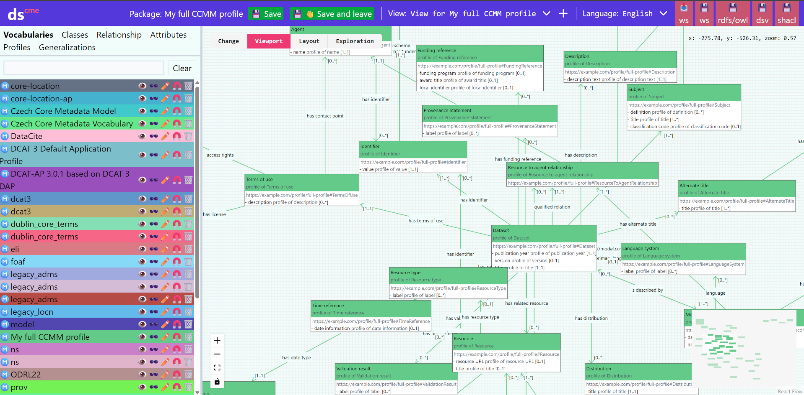
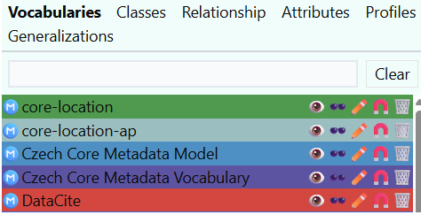

# Editor modelu
Editor modelu má tři základní části - Katalog modelů vlevo, plátno vpravo, a ovládací panel nahoře.
 

Ve editoru modelu jsou editovány jak [Slovníky](slovníky.md), obsahující definice tříd a vlastností, tak [Aplikační profily](aplikační-profily.md), obsahující profily tříd a profily vlastností.
Teoreticky v jednom modelu může být kombinace obojího, metodicky to však nedoporučujeme.

## Katalog
V hlavním rozhraní vidíme po levé straně katalog.
Katalog ukazuje nahrané slovníky a aplikační profily. seznamy tříd, vlastností, profilů a generalizací (specializací), včetně dědičnostních a profilovacích hierarchií.

 

**Classes (Třídy)**
 [Třída](slovník-pojmů.md#trida-class) označuje typ objektů, které sdílejí stejné vlastnosti a význam.

**Relationships(Vztahy)** Vztahy mezi jednotlivými třídami. 

**Attributes (Atributy)** [Atributy](slovník-pojmů.md#atribut-attribute) jsou vlastnosti jednotlivých tříd.

**Profiles (Profily)** Zde vidíme všechny prvky přidané do vytvořeného [Aplikačního profilu](slovník-pojmů.md#aplikacni-profil). 

**Generalizations**
Obsahuje seznam specializačních vazeb.

## Ovládací panel
V ovládacím panelu je nejdůležitějším prvkem možnost práci uložit (tlačítko 💾 Save), případně uložit a editor opustit (tlačítko 💾👋 Save and leave).
Práci je třeba pravidelně ukládat, v Dataspeceru není automatické ukládání.

## Plátno
Po pravé straně je plátno zobrazující aktuální diagram (view) zobrazující prvky modelu a vztahy mezi nimi.
V jedné specifikaci může být diagramů více, tvoří a přepínají se v ovládacím panelu nahoře.

V sekci layout je možné nastavit jakým způsobem se bude vizuální model zobrazovat.

