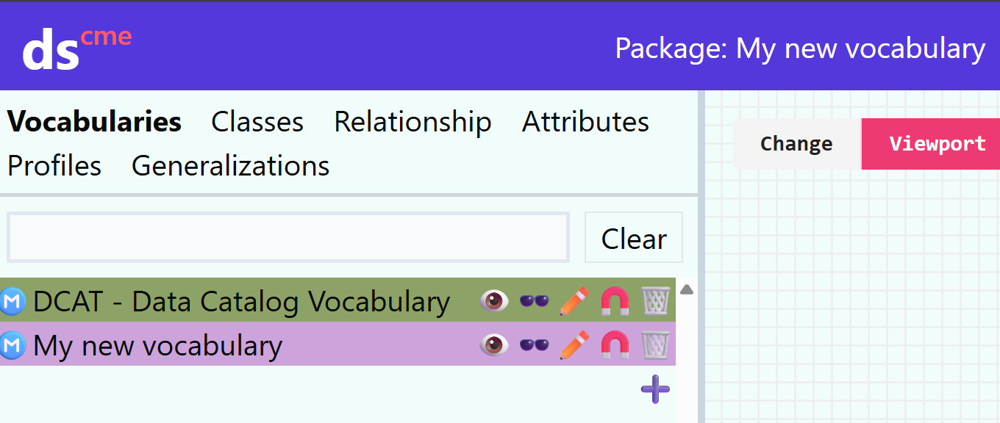
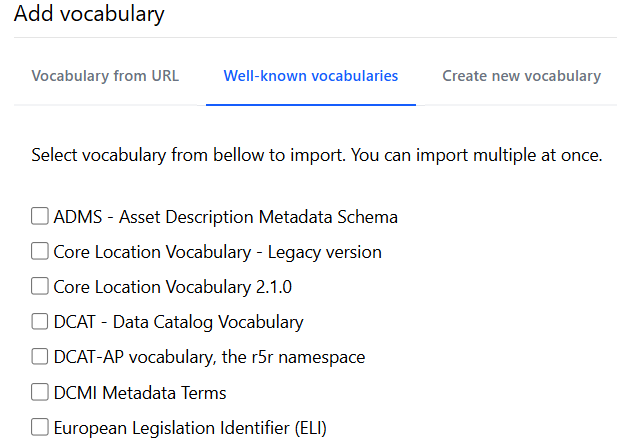
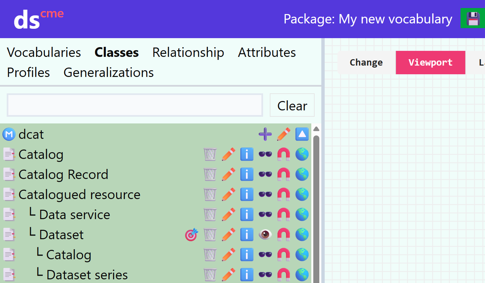

# Slovníky

Slovníky obsahují identifikátory, názvy a definice tříd a pojmů.
Slovník je třeba tvořit například pokud chceme do aplikačního profilu přidat vlastní pojmy, které nejsou součástí CCMM nebo jiného použitelného slovníku.
V takovém případe je nadefinujeme ve svém novém slovníku, který pak použijeme v aplikačním profilu.

Slovník vytvoříme jako nový projekt typu Slovník, čímž se dostaneme do [editoru modelu](editor-modelu.md).

## Tvorba slovníku

Při tvorbě slovníku je třeba definovat nové třídy, atributy a vlastnosti, případně jejich vztahy, jako definiční obor, obor hodnot či specializační vazba.
To lze dělat pomocí tlačítka ➕ v příslušné záložce katalogu.

### Třídy
Dialog pro přidání třídy nám umožní vyplnit název, identifikátor, čeho je třída specializací, definici a URL externí dokumentace třídy.
Ta se hodí, pokud už někde existuje, ale dané specifikace nebyla tvořena v Dataspeceru.

Pokud URL externí dokumentace vyplníme, tak v dokumentaci aplikačního profilu, ve kterém tuto třídu použijeme, povede odkaz právě na externí dokumentaci místo dokumentace slovníku generované z Dataspeceru.

### Atributy
Atribut můžeme přidat buď z katalogu, nebo po vybrání třídy na plátně.

### Vlastnosti
Vlastnost nebo generalizaci/specializaci lze přidat buď v katalogu, nebo potažením myší ze symbolu 🔗 mezi třídami.

## Přidání existujících slovníků do projektu

Pro využití pojmů z existujících slovníků, například pro definiční obor či obor hodnot nějaké vlastnosti, nebo pro specializaci třídy či vlastnosti, je třeba existující slovník přidat jako další model tlačítkem ➕ v sekci Vocabularies v katalogu.

Lze využít často používaných slovníků (well known vocabularies),

nebo importovat slovník prostřednictvím URL, přičemž je třeba, aby byl slovník dostupný v nějaké serializaci [RDF](slovník-pojmů.md#rdf), a webový server hostující slovník byl nakonfigurován pro podporu techniky [CORS](slovník-pojmů.md#cross-origin-resource-sharing-cors).

Následně budou třídy a vlastnosti ze slovníku přidány do katalogu, a je možné je přidávat na plátno a používat.

## Co nakonec?
Uložit pomocí tlačítka `💾👋 Save and leave` a [vygenerovat dokumentaci](dataspecer.md#moznosti-projektu).
Následně můžeme slovník vystavit na web, a použít třeba při tvorbě [aplikačního profilu](aplikační-profily.md).