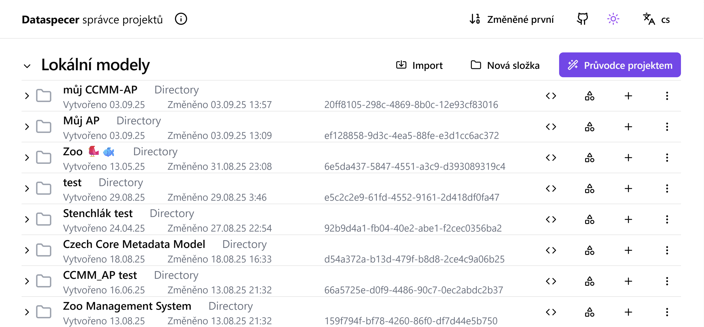

# Nástroj pro správu metadatových profilů: Dataspecer
Dataspecer je nástroj pro tvorbu, správu a vizualizaci sémantických datových specifikací, tj. slovníků a aplikačních profilů.
Na jejich základě je možné také odvozovat další technické artefakty, zejména datová schémata (XML, JSON, CSV).
Aplikaci můžete vyzkoušet na [demo instanci](https://demo.dataspecer.com/).
V rozhraní Dataspecer se specifikaci říká projekt.

## Správce projektů

Základním rozhraním je správce projektů.
Každý slovník a každý aplikační profil je samostatným projektem.
Projekt lze rozkliknout a vidět jeho vnitřní strukturu, to však nebudeme potřebovat.

## Možnosti projektu

- **Exportovat specifikaci** stáhne specifikaci vytvořeného slovníku/aplikačního profilu ve formě zip archivu k publikaci na webu, např. na [GitHub Pages](https://pages.github.com).
- **Zobrazit dokumentaci (cs/en)** zobrazí náhled dokumentace k vytvořené specifikaci v angličtině či češtině, viz [generovaná dokumentace](#generovana-dokumentace).
- **Upravit šablonu dokumentace** Otevře se HTML editor, kde lze editovat vzhled šablony vytvářené dokumentace. Ta využívá systém [ReSpec](https://respec.org/docs/).
- **Importovat z URL** umožní přidat existující slovník či aplikační profil vytovřený v Dataspeceru do aktuální specifikace.
- **Zálohovat do souboru** stáhne zálohu projektu ve formě ZIP archivu, který lze na libovolné Dataspecer instanci opět nahrát pomocí tlačítka Import. Nelze však takto nahrát zálohu na instanci, kde již importovaný projekt existuje.
- **Duplikovat** Vytvoří kopii projektu.   
- **Rename** přejmenuje projekt.  
- **Upravit data modelu** slouží pro debugování, nebudeme potřebovat.
- **Odstranit** vymaže projekt.

## Generovaná dokumentace

Generovaná dokumentace používá systém [ReSpec](https://respec.org/docs/) tak, jako běžné webové specifikace.
Obsahuje dokumentaci slovníku či aplikačního profilu, včetně odkazů na jednotlivé koncepty v přepoužitých slovnících a aplikačních profilech.
Dále obsahuje přílohy se strojově čitelnou reprezentací specifikace, případně s technickými artefakty.
Dokumentace je připravena k publikaci na webu, např. na [GitHub Pages](https://pages.github.com).

## Nová specifikace
Pro vytvoření nové specifikace klikneme na tlačítko Průvodce projektem.

A zvolíme jednu z možností:

**Slovník** Slovník vytváříme v případě, že potřebujeme definovat nové pojmy - třídy a vlastnosti.

**Aplikační profil** Vytváříme, pokud chceme specifikovat použití částí jiných specifikací v našem konkrétním kontextu. Například pokud vytváříme aplikační profil CCMM pro konkrétní doménový repozitář.

**Datové schéma** slouží pro tvrobu datových struktur přímo na základě existujících slovníků. Tuto volbu nebudeme používat.
