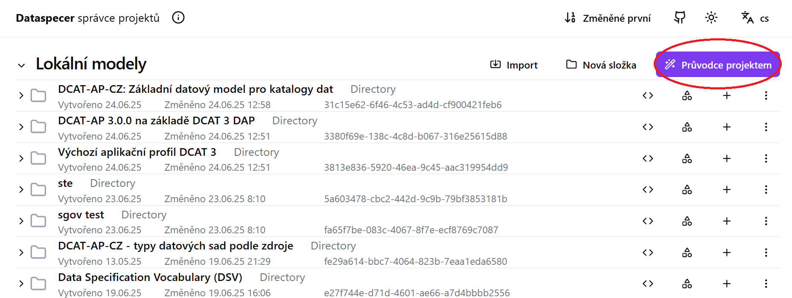

# Nástroj pro správu metadatových profilů: Dataspecer
Dataspecer je nástroj pro tvorbu, správu a vizualizaci sémantických datových specifikací, tj. slovníků a aplikačních profilů.
Na jejich základě je možné také odvozovat další technické artefakty, zejména datová schémata (XML, JSON, CSV).
Aplikaci můžete vyzkoušet na [demo instanci](https://demo.dataspecer.com/).

## Základní rozhraní

V základním rozhraní je zobrazen přehled již vytvořených projektů. 

### 1.Průvodce projektem
Vytváříme nový projekt (slovník, aplikační profil datové schéma),

**Slovník** Slovník vytvářím v případě, že potřebuje 

**Aplikační profil**  Využijeme když chceme upravit nebo vytvořit nový metadatový model. 

**Datové schéma**  Vytvářím konkrétné technické schéma (JSON, XML).

**Exportovat specifikaci** \- stáhne specifikaci vytvořeného slovníku/aplikačního profilu ve formě zip archivu.  

**Zobrazit dokumentaci  cs/en** Zobrazí náhled dokumentace k vytvořenému projektu. 

 **Upravit šablonu dokumentace** Otevře se html editor kde mohu editovat vzhled šablony vytvářené dokumentace. 

**Importovat z url   \-** umožní přidat existující slovník či profil do aktuální specifikace.

**Zálohovat do souboru  \-** Stáhne zálohu ve formě zip archivu.  
   
**Duplikovat \-** Vytvoří kopii projektu.   
**Rename \-** Přejmenuje projekt.  
**Upravit data profilu \-** pro debugování \- umožňuje textově editovat strojovou reprezentaci daného dataspecer modelu  
**Odstranit** \- vymaže projekt
