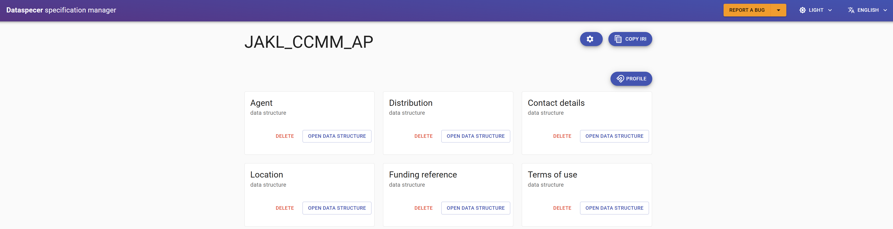
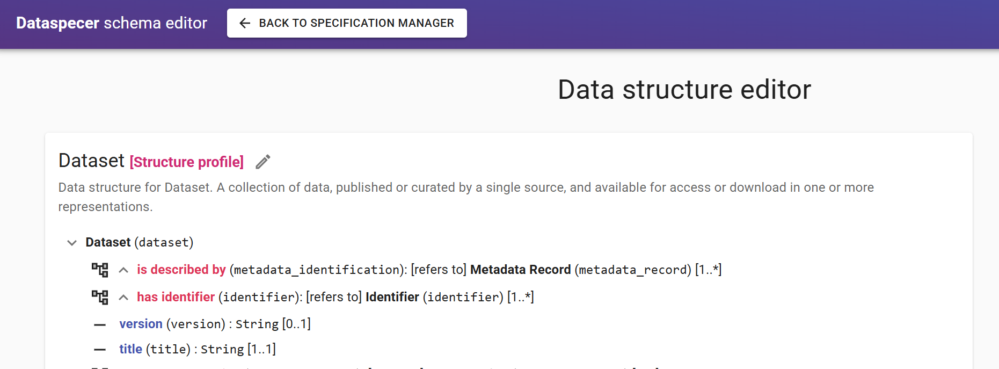
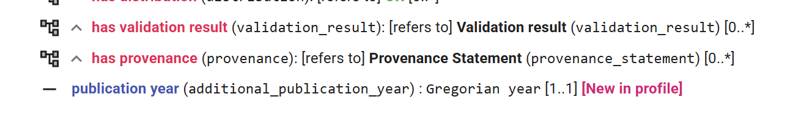
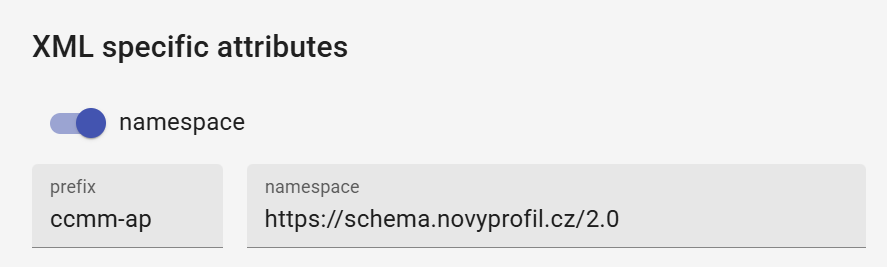
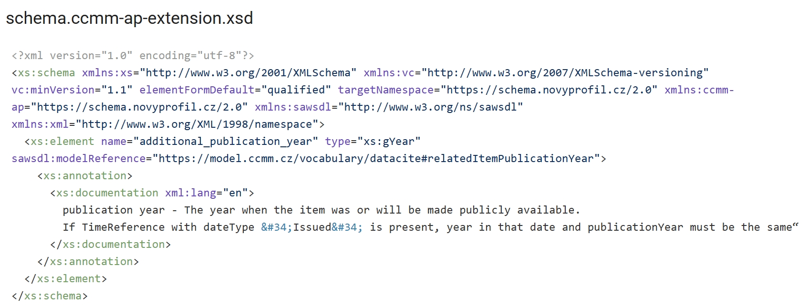

If we created a CCMM profile with the "Autoprofile" option, data structure profiles were created as well.



We use these so that the resulting XML schemas are also structurally compatible with those in CCMM.
When viewing a specific structure, we can see the `[Structure profile]` tag, which indicates that this data structure is a profile of an existing data structure (from CCMM).
Specifically, XML instances of these extended data structures should be valid against the original CCMM XSD, which, however, will not validate any extension.
XSDs generated from the data structure profile then validate CCMM including extensions.



In a data structure profile, we can add new items from the current application profile, extending the CCMM data structure at that point. Optional items can also be removed.
New items are marked with `[New in profile]`.



For the extended data structure, we also set a custom prefix and XML namespace.



When generating the resulting documentation, we get 2 XML schemas for each data structure profile:

An XML schema with the CCMM `targetNamespace`, e.g. `https://schema.ccmm.cz/research-data/1.1`, where, before the `<xs:any>` placeholder, our specified extension referencing the extension XML schema is used.
  
```xml
<xs:schema xmlns:xs="http://www.w3.org/2001/XMLSchema" 
xmlns:vc="http://www.w3.org/2007/XMLSchema-versioning" 
vc:minVersion="1.1" elementFormDefault="qualified" 
xmlns:ccmm="https://schema.ccmm.cz/research-data/1.1" 
xmlns:sawsdl="http://www.w3.org/ns/sawsdl" 
xmlns:xml="http://www.w3.org/XML/1998/namespace" 
xmlns:ccmm-ap="https://schema.novyprofil.cz/2.0"
targetNamespace="https://schema.ccmm.cz/research-data/1.1">
	<xs:import namespace="https://schema.novyprofil.cz/2.0" schemaLocation="/jakl_ccmm_ap/dataset/schema.ccmm-ap-extension.xsd"/>
	<xs:complexType name="dataset" sawsdl:modelReference="http://www.w3.org/ns/dcat#Dataset">
		<xs:sequence>
			...
			<xs:element ref="ccmm-ap:additional_publication_year"/>
```

An extension XML schema with the extension namespace, referenced from the previous XSD.




