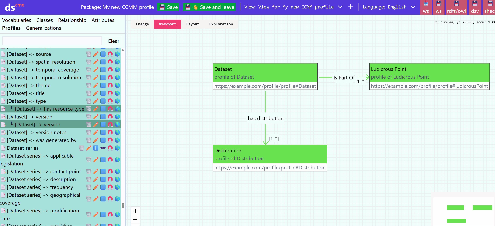
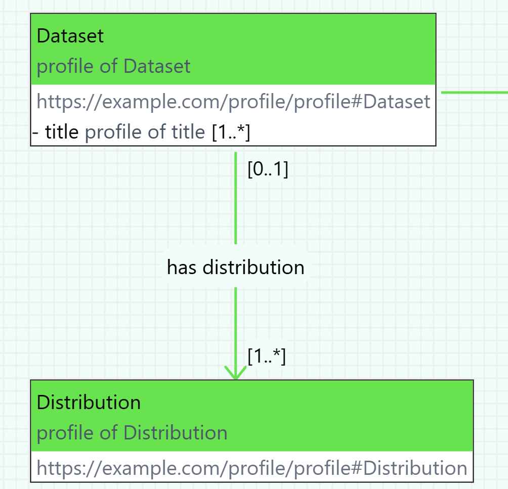

# Application Profiles

An application profile (AP) defines which concepts from which specifications, vocabularies, or other application profiles are used in a given context and how.
Before we start creating the actual application profile for our repository in Dataspecer, it is necessary to become thoroughly familiar with the default metadata model [Czech Core Metadata Model (CCMM)](https://www.ccmm.cz/).

## What to clarify before creating a metadata profile for a repository
1. Do we need our own application profile? If CCMM covers my needs, I don't need any other application profile.

2. What will we describe? Does the default metadata model (CCMM) and available vocabularies allow describing all necessary entities? Are there domain vocabularies that can be used for our repository? Are they available in a suitable format, i.e., RDF? If not, we need to define missing concepts in our [own vocabulary](slovníky.md), which will then be used in the new application profile.

3. We think about which elements from CCMM and other vocabularies or profiles we will adopt, and how we will use them in our profile. We set rules on how to use them. For example, whether they will be mandatory, with what cardinality, etc. We must not violate CCMM rules.

Vocabularies or application profiles that we want to use in Dataspecer must be hosted on a web server supporting [Cross origin resource sharing (CORS)](https://fetch.spec.whatwg.org/#http-cors-protocol) technique.
If they are hosted on a server that does not support CORS technique, and it is not in our power to ensure support, we can copy the file to a web that supports CORS technique, e.g., [GitHub Pages](https://pages.github.com).

## Creating a new application profile
In the main menu, choose "Project Guide" – Create application profile.

1. Enter **project name** (e.g., "CCMM AP for domain XY").

2. Insert **specification URL** of the model from which you want to create the application profile.  
   If you are creating an application profile for CCMM, insert a link to it:  
   [https://techlib.github.io/CCMM/en/](https://techlib.github.io/CCMM/en/)

3. Fill in **Base IRI** – basic IRI (Internationalized Resource Identifier),  
   under which elements of your profile will be identified: `https://example.com/profile/myprofile/`

   **Note:** We recommend thinking ahead; however, it can be modified later.
The *profile* tab contains all vocabularies used in the default metadata model.
I can display what the selected vocabulary contains.

### Starting to profile - all or nothing
Once we create an application profile, and for simplicity let's assume it's a CCMM profile, we're greeted by the [model editor](editor-modelu.md) with a blank canvas representing the new application profile.
Here we have two options for how to proceed.
Either we want to select what we'll use from CCMM, which we'll gradually do using the 🧲 icon for class profiles, properties, and attributes we're interested in, in the `Profiles` tab.

Alternatively, we can profile everything in CCMM, and gradually delete what we don't need.
We do this using the 🧲 icon for the `Czech Core Metadata Model` model in the `Vocabularies` tab.

### Creating a class profile

We can add either profiles of classes, attributes, and properties from vocabularies in the respective catalog tabs, or profiles of their profiles in existing application profiles, on the `Profiles` tab.
We always create a profile in the current application profile using the 🧲 icon.

Profiles of classes, properties, attributes, and their profiles that are in the current application profile can be seen on the `Profiles` tab.

After clicking 🧲, a window opens for setting up the profile.
For classes, you can modify:

**Name:** Class naming.

**IRI** *(International Resource Identifier)* Class identifier - must be unique, which Dataspecer does not ensure.

**Specialization:** Whether it is a specialization of another class.

**Definition:** Definition of the class profile. Can also be stated in several languages.

**Usage note:** Note on the use of the given class in the context of the application profile. E.g., "In this profile, dataset is used for XYZ."

**External documentation URL:** Link to external documentation describing the given class. This link will be used in profiles of the current profile instead of documentation generated from this profile.

**Role:** I determine whether the class profile will have a main or supportive role. Main roles are important elements of the metadata profile, e.g., dataset, catalog. Supportive includes less important ones, e.g., theme. Roles are not inherited between profiles. In the resulting documentation, class profiles are then grouped according to role - first main, then secondary.

### Creating an attribute profile

1. In the `Profiles` or `Attributes` tab, we select an attribute profile or attribute whose profile we want to create (which we want to use in our AP), and press 🧲.
2. We set the class profile in the current AP that will be the domain of the attribute profile.
3. (Optional) We can modify the name, identifier, definition, and note on its use within our application profile and external documentation URL.
4. (Optional) We set the cardinality **Range cardinality**
5. (Optional) We select the data type in **Range**, e.g., `xsd:boolean`, `xsd:string`, `rdf:langString`, etc.
6. (Optional) We select the obligation level - `Undefined`, if we don't use this in our AP, or `Mandatory`, `Recommended`, or `Optional`, if we do. Within the diagram, attributes will then be in sections according to this obligation.

**Note:** For attributes and their profiles, or relationships displayed as attributes, i.e., within a class or class profile, the order can be changed using 🔼🔽 after clicking on the class. Alternatively, you can change the order and change the display of relationships as attributes in the dialog after pressing the 📏 button on the class.

### Creating a relationship profile
To create a relationship profile, we proceed the same way as for an attribute profile, i.e., in the catalog in the `Relationships` or `Profiles` tab using the 🧲 button.

The only difference is that we need to select not only the domain but also the range of the relationship profile, again one of the class profiles in our AP.
It may also make sense to fill in **Domain cardinality** to determine cardinality in the opposite direction of the relationship.

Let's recap what cardinalities mean.

In the example, there is a `has distribution` relationship profile between the `Dataset` class profile and the `Distribution` class profile, leading from `Dataset` (domain) to `Distribution` (range).

Range cardinality `[1..*]` means that each dataset always has at least one distribution, but can have more.
Domain cardinality `[0..1]` means for each distribution that it may or may not be connected to a dataset, and when it is, at most to one.

## What in the end?
Save using the `💾👋 Save and leave` button and [generate documentation](dataspecer.md#moznosti-projektu).
Subsequently, we can publish the application profile on the web and use it, for example, when creating another application profile.