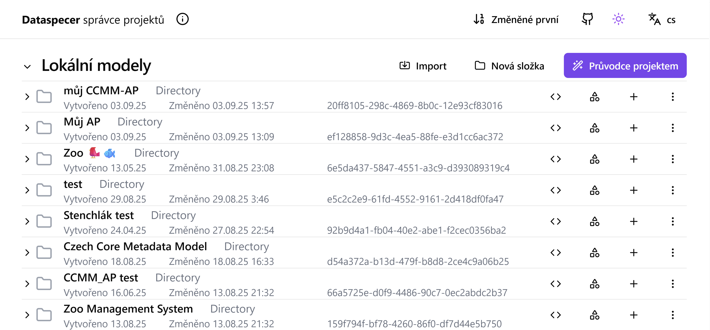
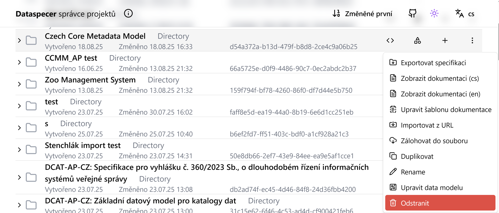
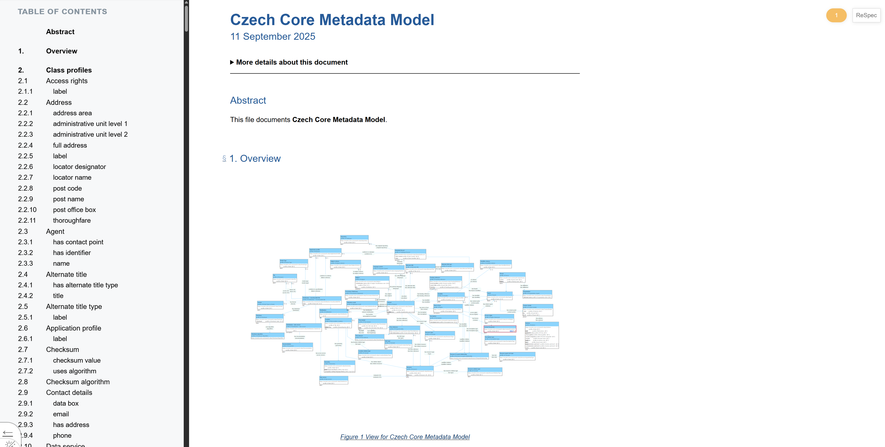

# Tool for Metadata Profile Management: Dataspecer
Dataspecer is a tool for creating, managing and visualizing semantic data specifications, i.e., vocabularies and application profiles.
Based on these, it is also possible to derive other technical artifacts, especially data schemas (XML, JSON, CSV).
You can try the application on the [demo instance](https://demo.dataspecer.com/).
In the Dataspecer interface, a specification is called a project.

## Project Manager

The basic interface is the project manager.
Each vocabulary and each application profile is a separate project.
You can click on a project to see its internal structure, but we won't need that.

## Project Options

- **Export specification** downloads the specification of the created vocabulary/application profile as a zip archive for web publication, e.g., on [GitHub Pages](https://pages.github.com).
- **Show documentation (cs/en)** displays a preview of the documentation for the created specification in English or Czech, see [generated documentation](#generated-documentation).
- **Edit documentation template** Opens an HTML editor where you can edit the appearance of the template for creating documentation. It uses the [ReSpec](https://respec.org/docs/) system.
- **Import from URL** allows adding an existing vocabulary or application profile created in Dataspecer to the current specification.
- **Backup to file** downloads a backup of the project as a ZIP archive, which can be uploaded again to any Dataspecer instance using the Import button. However, you cannot upload a backup to an instance where the imported project already exists.
- **Duplicate** Creates a copy of the project.
- **Rename** renames the project.
- **Edit data model** is used for debugging, we won't need it.
- **Delete** deletes the project.

## Generated Documentation

The generated documentation uses the [ReSpec](https://respec.org/docs/) system, like common web specifications.
It contains documentation of the vocabulary or application profile, including links to individual concepts in reused vocabularies and application profiles.
It also contains appendices with machine-readable representation of the specification, possibly with technical artifacts.
The documentation is ready for web publication, e.g., on [GitHub Pages](https://pages.github.com).

## New Specification
To create a new specification, click on the Project Guide button.

And choose one of the options:

[**Vocabulary**](slovníky.md) is created when we need to define new concepts - classes and properties.

[**Application Profile**](aplikační-profily.md) is created when we want to specify the use of parts of other specifications in our specific context. For example, when creating a CCMM application profile for a specific domain repository.

**Data Schema** is used to create data structures directly based on existing vocabularies. We will not use this option.