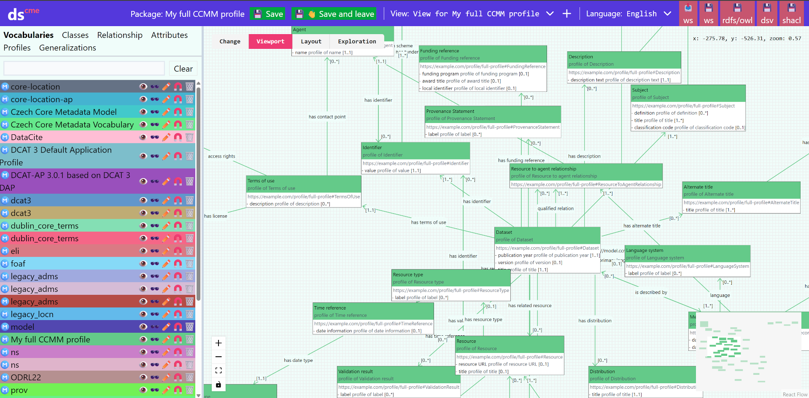
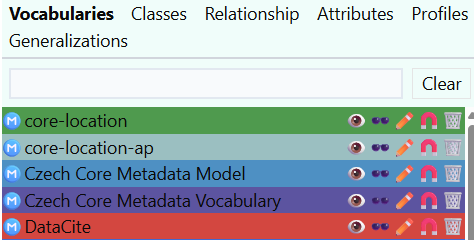

# Model Editor
The model editor has three basic parts - Model catalog on the left, canvas on the right, and control panel at the top.
 

In the model editor, both [Vocabularies](slovníky.md), containing definitions of classes and properties, and [Application Profiles](aplikační-profily.md), containing profiles of classes and profiles of properties, are edited.
Theoretically, one model can be a combination of both, but we do not recommend this methodologically.

## Catalog
In the main interface, we see a catalog on the left side.
The catalog shows loaded vocabularies and application profiles, lists of classes, properties, profiles, and generalizations (specializations), including inheritance and profiling hierarchies.

 

**Classes**
 [Class](slovník-pojmů.md#class) designates a type of objects that share the same properties and meaning.

**Relationships** Relationships between individual classes.

**Attributes** [Attributes](slovník-pojmů.md#attribute) are properties of individual classes.

**Profiles** Here we see all elements added to the created [Application Profile](slovník-pojmů.md#application-profile).

**Generalizations**
Contains a list of specialization relationships.

## Control Panel
In the control panel, the most important element is the option to save work (💾 Save button), or save and leave the editor (💾👋 Save and leave button).
Work needs to be saved regularly, there is no automatic saving in Dataspecer.

## Canvas
On the right side is the canvas displaying the current diagram (view) showing model elements and relationships between them.
There can be multiple diagrams in one specification, they are created and switched in the control panel at the top.

In the layout section, it is possible to set how the visual model will be displayed.

