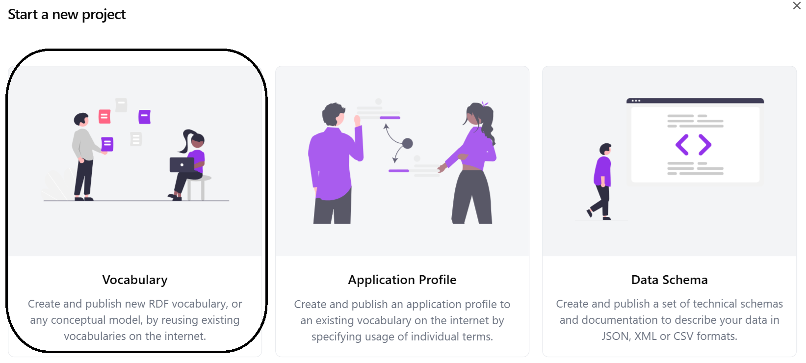
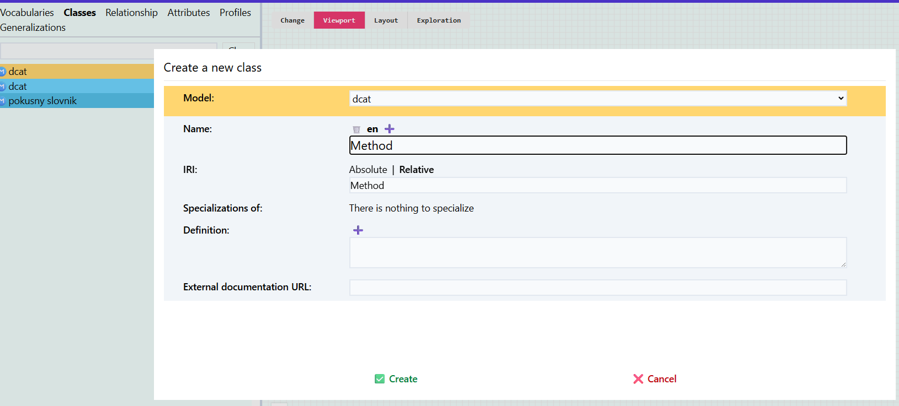
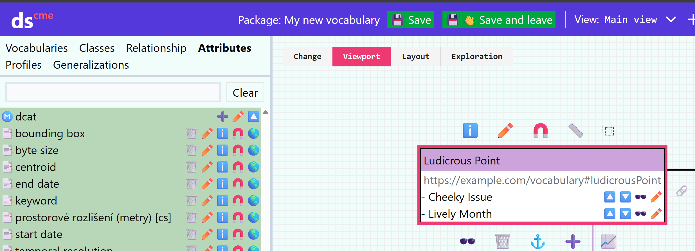
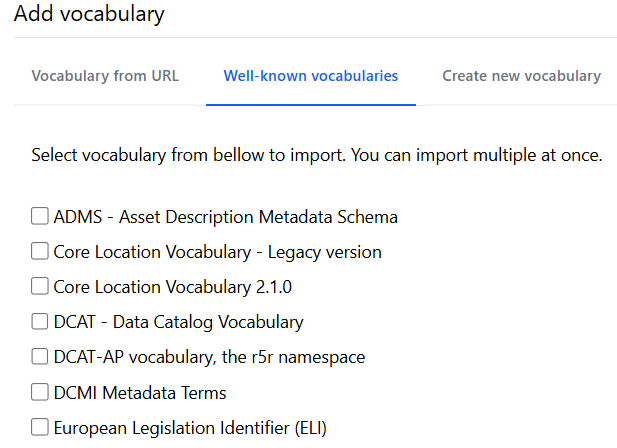
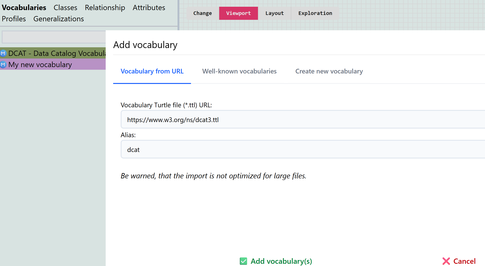
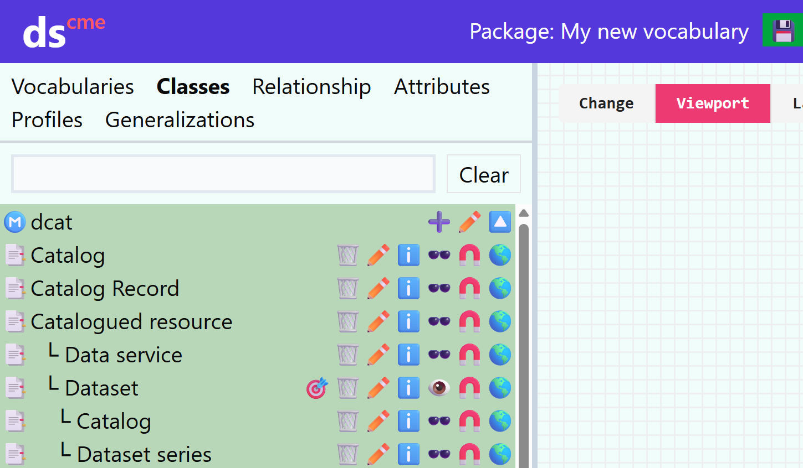

# Vocabularies

Vocabularies contain identifiers, names, and definitions of classes and concepts.
A vocabulary needs to be created, for example, when we want to add our own concepts to the application profile that are not part of CCMM or another usable vocabulary.
In such case, we define them in our new vocabulary, which we then use in the application profile.

We create a vocabulary as a new project of type Vocabulary, which takes us to the [model editor](editor-modelu.md).

## Creating a vocabulary

When creating a vocabulary, it is necessary to define new classes, attributes, and properties, or their relationships, such as domain, range, or specialization relationship.
This can be done using the ➕ button in the corresponding catalog tab.

### Classes
The dialog for adding a class allows us to fill in the name, identifier, what the class is a specialization of, definition, and URL of external documentation for the class.
This is useful if it already exists somewhere, but the given specification was not created in Dataspecer.

If we fill in the external documentation URL, then in the documentation of the application profile in which we use this class, the link will lead to the external documentation instead of the vocabulary documentation generated from Dataspecer.

### Attributes
We can add an attribute either from the catalog or after selecting a class on the canvas.

### Properties
A property or generalization/specialization can be added either in the catalog or by dragging the mouse from the 🔗 symbol between classes.

## Adding existing vocabularies to the project

To use concepts from existing vocabularies, for example for domain or range of some property, or for specialization of a class or property, it is necessary to add the existing vocabulary as another model using the ➕ button in the Vocabularies section in the catalog.

You can use frequently used vocabularies (well known vocabularies),

or import a vocabulary via URL, where the vocabulary must be available in some [RDF](slovník-pojmů.md#rdf) serialization, and the web server hosting the vocabulary must be configured to support [CORS](slovník-pojmů.md#cross-origin-resource-sharing-cors) technique.

Subsequently, classes and properties from the vocabulary will be added to the catalog, and it is possible to add them to the canvas and use them.

## What in the end?
Save using the `💾👋 Save and leave` button and [generate documentation](dataspecer.md#moznosti-projektu).
Subsequently, we can publish the vocabulary on the web and use it, for example, when creating an [application profile](aplikační-profily.md).