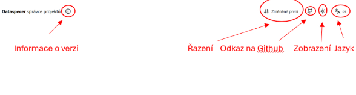

# Nástroj Dataspecer
Dataspecer je nástroj pro správu sémantických datových specifikací,slovníků a aplikačních profilů až po odvozené technické artefakty, jako jsou datová schémata (xml, json, csv), validační pravidla, API a aplikační prototypy.
Aplikace je přístupná z webové adresy demo.dataspecer.com
## Základní rozhrani

**Slovník** V případě, že potřebuje nadefinovat slovník, popsat třídy který nejsou součástí metadatového modelu.
**Aplikační profil**  Využijeme když chceme upravit konkrétní metadatový model (CCMM)
**Datové schéma**  Vytvářím konkrétné technické schéma (JSON, XML).

