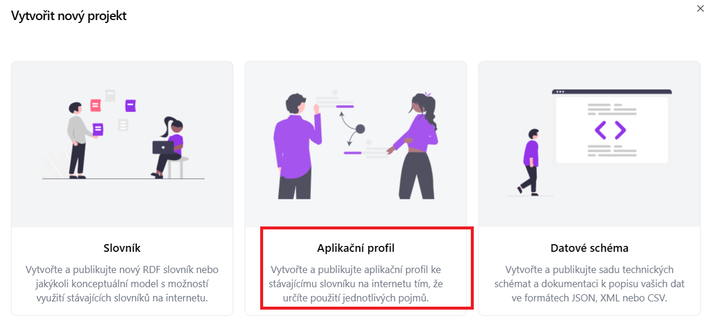
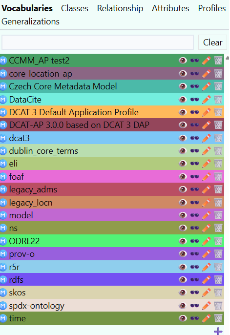
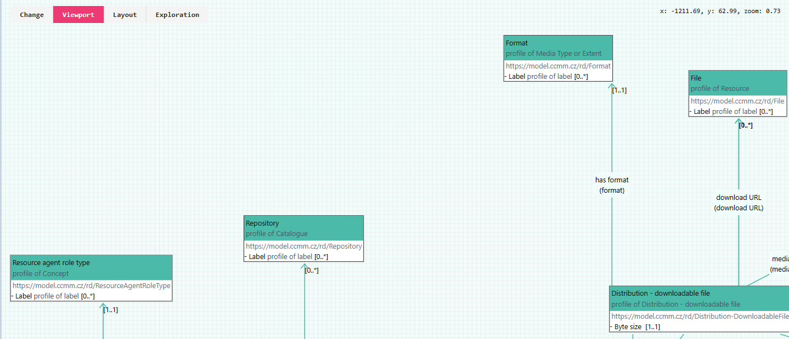
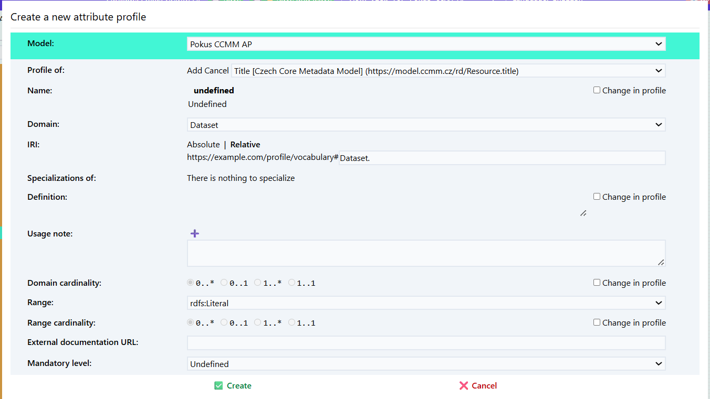

## Vytvoření nového aplikačního profilu
<<<<<<< HEAD
Při vytváření aplikačního profilu přebírám prvky z
=======
Při vytváření aplikačního profilu převezmeme třídy ze zvoleného aplikačního profilu. Vlastní prvky které chceme přidat nadefinujeme ve slovníku.
>>>>>>> origin

V hlavním menu zvolte možnost „Průvodce projektem“ – Vytvořit aplikační profil.

1. Zadejte **název projektu** (např. „CCMM AP“).

2. Vložte **URL specifikaci** modelu, ze kterého chcete aplikační profil vytvořit.  
   Pokud vytváříte aplikační profil pro CCMM, vložte link na něj:  
<<<<<<< HEAD
   [CCMM/](https://techlib.github.io/CCMM/cs/)
=======
   [https://eosc-cz.github.io/CCMM/cs/](https://eosc-cz.github.io/CCMM/cs/)
>>>>>>> origin

3. Vyplňte **Base IRI** – základní IRI (Internationalized Resource Identifier),  
   pod kterým budou identifikovány prvky vašeho profilu:  
   [https://example.com/profile/mujprofil/](https://example.com/profile/mujprofil/)

<<<<<<< HEAD
**Poznámka:** Doporučujeme promyslet předem; lze jej však později upravit.
Záložka *profile* obsahuje všechny slovniky použité ve výchozím metadatovém modelu.

Mohu si zobrazit co obsahuje zvolený slovník.

=======
> **Poznámka:** Doporučujeme promyslet předem; lze jej však později upravit.

>>>>>>> origin
---

## ▶️ Definice tříd zahrnutých do aplikačního profilu

Po vytvoření nového aplikačního profilu se nám otevře editor aplikačního profilu.

<<<<<<< HEAD

=======
Záložka *profile* obsahuje všechny prvky použité ve výchozím metadatovém modelu.
>>>>>>> origin

Zvolím položku, kterou chci přidat do mého aplikačního profilu (např. Agent).  
Klikneme na **Create new profile** (symbol podkovy).

Rozhodneme se, zda chceme třídu převzít tak, jak je definována ve výchozím metadatovém modelu, nebo ji budeme upravovat.

**Name:**  
Pojmenování třídy.

**IRI** *(International Resource Identifier)*  
Identifikátor třídy.

**Specialization:**  
Zda se jedná o specializaci jiné třídy.

**Definition:**  
Stručný popis dané třídy. Možné uvést i v několika jazycích.  
**Příklad:**  
*Agent: Any entity carrying out actions with respect to the entities Catalogue and the Catalogued Resources.*

**Usage note:**  
Poznámka k použití dané třídy. Př. "V tomto profilu se dataset pooužívá pro XYZ."

**External documentation:**  
Odkaz na externí dokumentaci popisující danou třídu.

**Role:**  
Určím se zda bude role hlavní (main) nebo podpůrná (supportive). Hlavní role jsou důležité prvky metadatového profilu př. dataset, katalog. Podpůrná zahrnuje méně důležité např. téma. Role se nedědí mezi profily.

Vlevo vidím katalog - třídy v aplikačním profiu. Přidané jsou vybarvené zeleně. Vpravo je vizuální model.

## ▶️ Přidání atributů
<<<<<<< HEAD
U tříd je následně třeba přidat atributy.
1. Atribut přidám symbolem plus. Zvolím si například 

2. Nadefinujte si pro z čeho vycházíte **Profile of** a pro jakou třídu atribut definujete **Domain**

## ▶️ Přidání vazeb mezi třídami
Nyní si přidáme do svého profilu další třídu (funding reference).
V části relationsh přidám vztah mezi těmito třídami (has funding reference).

## ▶️ Číselník
Číselník se přidávají prostřednictvím SKOS. 

## ▶️ Nadefinování vlastních pojmů ve Slovníku
=======
1. Atribut přidám symbolem plus.

2. Nadefinujte si pro z čeho vycházíte **Profile of** a pro jakou třídu atribut definujete **Domain**
U tříd je následně třeba definovat atributy:

>>>>>>> origin

